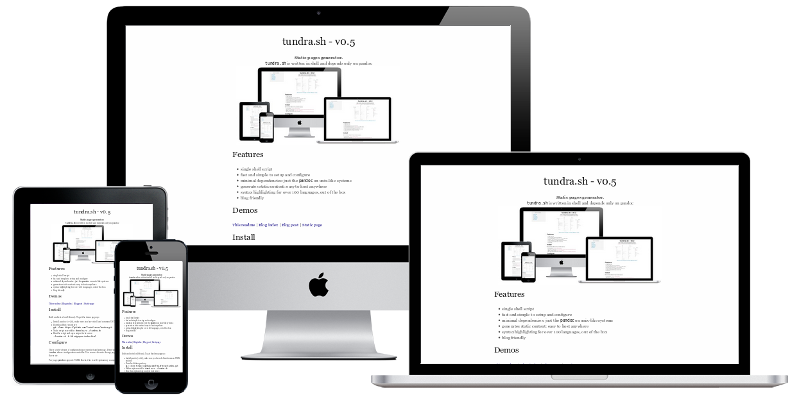

<h1 align="center">tundra.sh - v1.0</h1>
<div align="center">
  <strong>Static pages generator.</strong>
</div>
<div align="center">
  <code>tundra.sh</code> is written in shell and depends only on pandoc
  
</div>

## Features
- markdown sources*
- single shell script
- fast and simple to setup and configure
- minimal dependencies: just the `pandoc` on unix-like systems
- generates static content: easy to host anywhere
- syntax highlighting out of the box
- blog friendly

## Demos
[This readme](https://frainfreeze.github.io/tundra/) | [Blog index](https://frainfreeze.github.io/tundra/posts/index.html) | [Blog post](https://frainfreeze.github.io/tundra/posts/post0.html) | [Static page](https://frainfreeze.github.io/tundra/pages/bookshelf.html)

## Install
Built and tested on Debian 10. To get the demo page up:
- Install pandoc (>v2.0), make sure you have shell and common UNIX utilities
- Download this repository: `git clone https://github.com/frainfreeze/tundra.git`
- Make script executable: `chmod a+rx ./tundra.sh`
- Run the script and open output in browser: `./tundra.sh -b && xdg-open index.html`

> NOTE: If you want to use this script on *BSD or macOS, please make sure you have the GNU implementation of `awk` and `sed` installed.

## Configure
There are two types of configuration: per project and per page.
Per project: on top of `tundra.sh` are configuration variables.
You can use them to change page theme, markdown flavor etc.

Per page: `pandoc` supports YAML blocks, this is self-explanatory example:

```yaml
---
title: "Example title"
author: "author"
date: 2020-01-21
---
```

I recommend you to keep the block on the top of the file. 
See [pandoc documentation](https://pandoc.org/MANUAL.html#extension-yaml_metadata_block) for more details.

## Customize
To change index page simply edit this readme or configure `tundra.sh` 
to point at your index.md file. See `configure` above.

To make new blog posts add source files to posts folder.

Run `./tundra.sh -h` to see available options.

## License
Public domain.