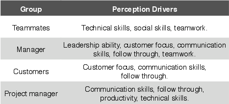
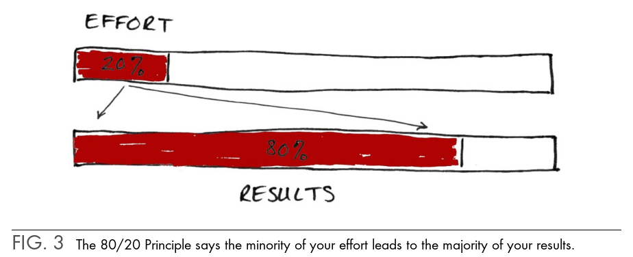
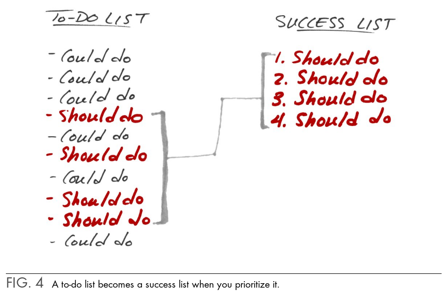
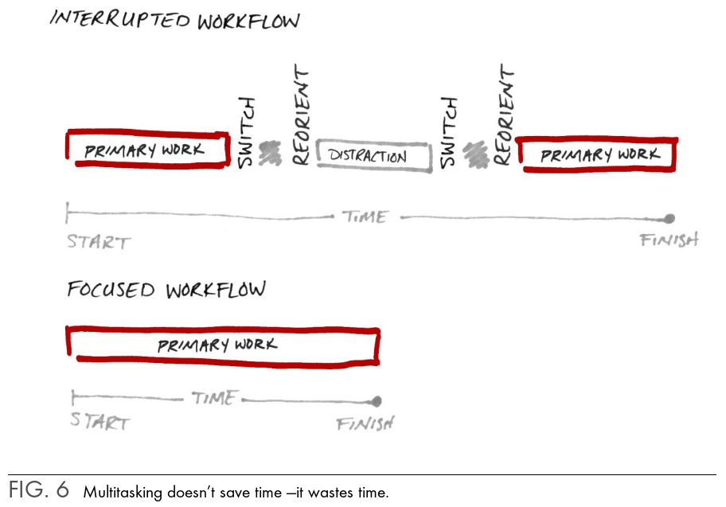
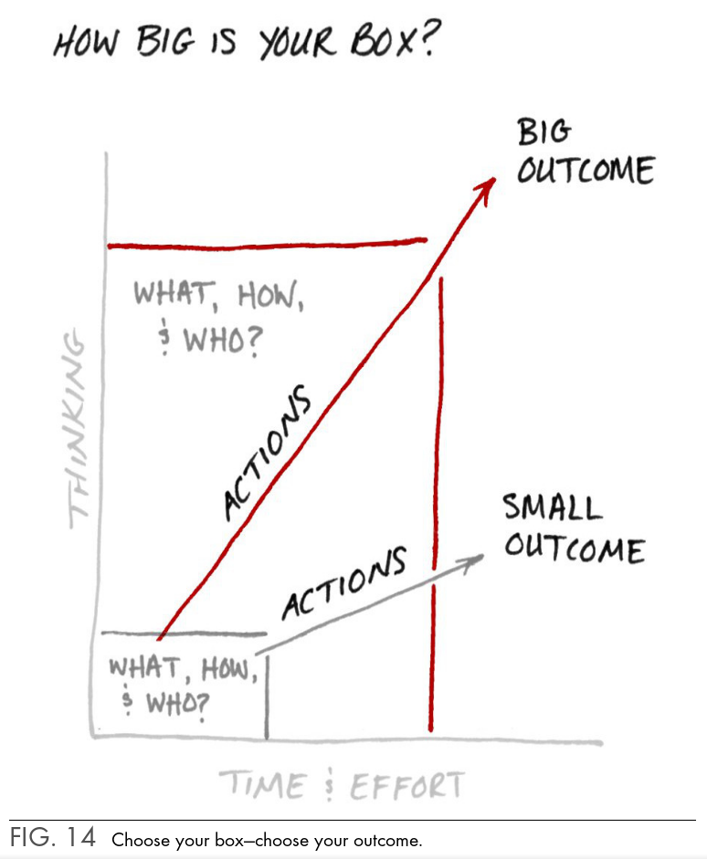
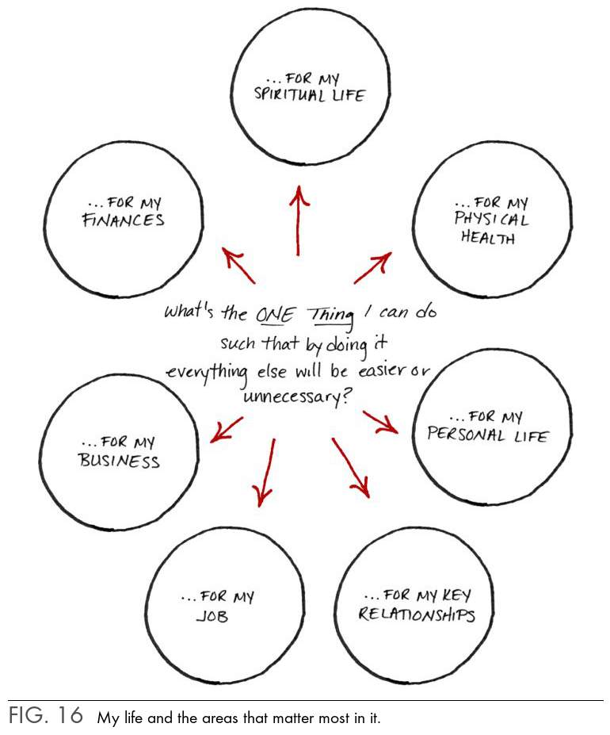
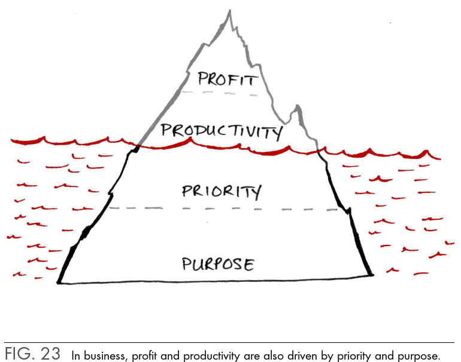
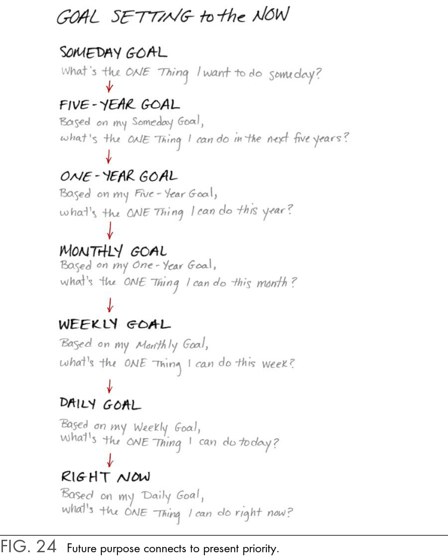
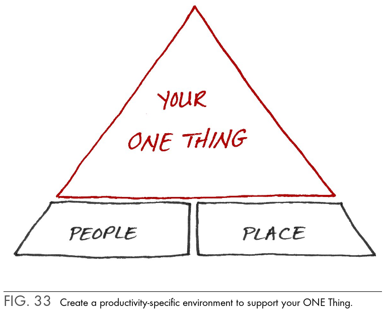
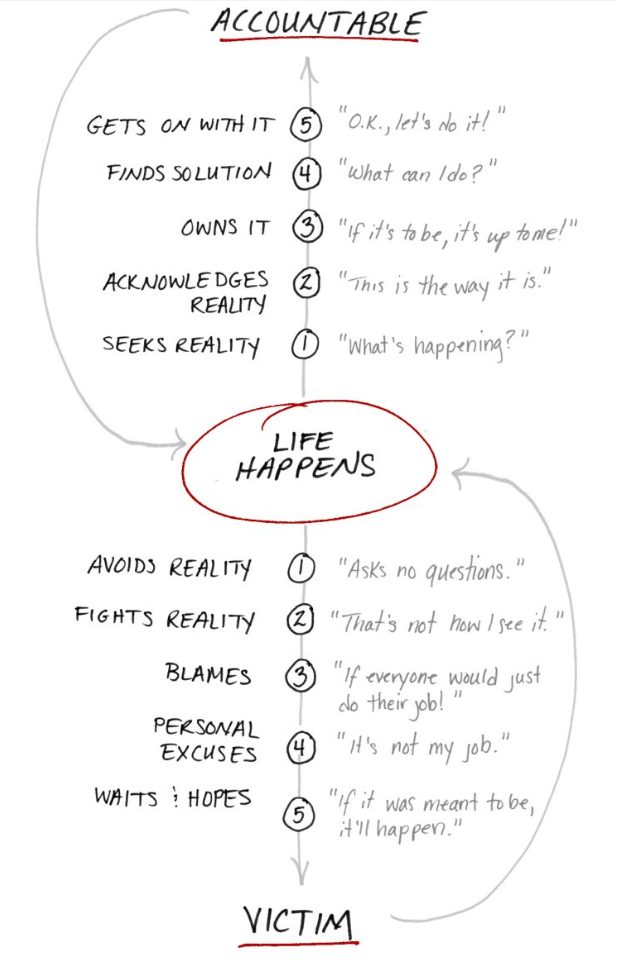

<!-- 

{#title}
```
ISBN: {ISBN}
Tags: {tags}
Date read: {date}
Rating: {rating}
```

**Description:**
{description}

**Notes & Quotes:**
{notes-quotes}

----

-->

# Book Notes

Next to title, ISBN, and rating I have added a short description (usualy found on back cover) and my notes.
This page will constantly update as I read more, so bookmark it if you want to check back in a few months.

Read a good book 10 times rather than 10 bad books.

Tags: Autobiography, Ethics & Morality, Philosophy, Productivity, Psychology, Self-help, Health, Science Software, Stoicism, Time management, Decision making, Problem solving

Check out my [bookshelf](bookshelf.html) or go to [home page](../index.html).

<br>

<div align="center">
    <h1>2019</h1>
</div>

----


# Why we sleep
```
ISBN: 978-1501144318
Tags: Science, Health
Date read: 6.9.2019.
Rating: 5/5
```

**Description:**
The first sleep book by a leading scientific expert—Professor Matthew Walker, 
Director of UC Berkeley’s Sleep and Neuroimaging Lab—reveals his groundbreaking 
exploration of sleep, explaining how we can harness its transformative power 
to change our lives for the better.

**Notes & Quotes:**

**ALL STAGES OF SLEEP ARE IMPORTANT.** If sleep wouldn’t serve 
an absolutely vital function it is the biggest mistake the 
evolutionary process ever made. That counts for all of the 
stages of sleep. It’s been proven that all have unique and 
separate functions. Necessity of two hour dream sleep? When 
mother nature burns calories it’s usually for a reason.... 

We need to radically rethink the importance of sleep in education, 
business, the work place and in medicine. Sleep isn’t the third 
pillar of good health (amongst diet and excercise)… it’s the 
foundation on which those two other things sit. For example: if 
you’re dieting but not getting sufficient sleep 70% of all the 
weight that you’ll lose will come from lean body mass (muscle and 
not fat). Your body doesn’t want to give up it’s fat when under slept. 
Human beings are the only species that deliberately deprive 
themselves of sleep for no apparent reason. Mother nature has never 
faced the challenge of coming up with a safety net for lack of sleep. 
We’ve never been forced to come up with that solution. That’s why we 
get such demonstrable disease, sickness and impairment when we get 
a lack of sleep. Only animals under extreme starvation might deprive 
themselves a bit. That’s why people who vast receive this ancient 
trigger that you need to stay awake and hunt for food. 

Epidemiological studies across millions of people shows the shorter 
you sleep the shorter your life. You’ll be dead sooner and the quality 
of that now shorter life will be significantly worse. 

### Sleeping 6h or less:
- (Below 7 hours objective impairments become visible) 
- Men who sleep 5-6 hours a night will have a level of testosterone 
  which is that of someone 10 years older. Muscle strength, virility, 
  sexual performance also suffer. 
- Insufficient sleep across the life span now seems to be one of THE 
  most significant lifestyle factors determining whether or not you’ll 
  develop Alzheimers. It’s during deep sleep at night: there’s a sewage 
  system in the brain that kicks in high gear and cleanses the brain of 
  all the metabolic toxins that have been built up during the day. One 
  of those toxic sticky proteins that builds up is called beta amyloid. 
  That’s one of the leading causes of underlying the mechanism of Alzheimers 
  disease. So the less sleep across the life span the more of that toxic 
  amyloid is building up night after night, year after year. 
- Your time to physical exhaustion drops up to 30%. 
- Lactic acid builds up quicker 
- The ability of the lungs to expire carbon dioxide and inhale oxygen decreases 
- The less you sleep the higher the risk of injury. Almost perfect linear 
  correlation with top athletes (9 vs 5 hours of sleep: almost 60% bigger 
  risk). Stability muscles decrease dramatically as well. 
- You’ll be dead sooner and the quality of that now shorter life will be 
  significantly worse. 
- The link between a lack of sleep and cancer is quit strong. Insufficient 
  sleep is linked to cancer of the bowel, prostate and breast... The association 
  has become so powerful that the World Health Organization recently decided 
  to classify any form of night time shift work as a probable cause for cancer. 
- The hormone Leptin (you’re full: stop eating!) gets suppressed by a lack of 
  sleep. Ghrelin (the hunger hormone) increases! People who sleep 5-6 hours 
  a night will on average eat between 200 and 300 extra calories each day because 
  of the under slept state. That’s about 70.000 a year = 10/15 pounds of obese 
  mass a year. You also eat more of the wrong things! Researched very well! 
  Plot the rise of obesity over the last 70 years and plot on the same graph 
  it goes in the opposite direction. As sleep time is declined obesity rates 
  have increased. (Obesity also has other factors that cause it but sleep is 
  a big one) - The number of people that can survive on 6 hours of sleep or 
  less without showing any impairment is 0.) 
- You don’t know that you’re sleep deprived when you’re sleep deprived. 
- Study: gave people 4 hours of sleep each night. They saw a 70% decrease 
  in critical anti cancer fighting immune cells called natural kilo cells. 
  These are wonderful immune assassins that target malignant cells. We all 
  produce cancer cells during the day. What prevents those cancer cells 
  from becoming cancer is in part these natural kilo cells. After one night 
  of 4 hours of sleep there is a remarkable state of immune deficiency. 
  This is why insufficient sleep predicts cancer. 
- Cardiovascular system: all it takes is one hour. Daylight savings time. 
  In the spring when we lose an hour of sleep we see a subsequent 24% 
  increase in heart attacks around the world. In the fall when we gain 
  an hour we see a 21% decrease in heart attacks. That’s how fragile and 
  vulnerable your body is regarding sleep. 
- It will even erode your DNA code: Group of healthy adults 6 hours of 
  sleep for a week. They compared their profile of gene activity relative 
  to when those same people were getting eight hours of sleep. Two critical 
  results. First: a sizeable 711 genes were distorted in their activity. 
  Second: half of those genes were increased in their activity other half 
  were suppressed. Those that were switched off by six hours of sleep were 
  related to your immune response. So you become immune deficient. The ones 
  that increased were ones related to the production of tumors, long term 
  inflammation in the body and genes related to stress and as a consequence 
  cardiovascular disease. 

### Being awake for a long time:
- After 20 hours of being awake you are as impaired cognitively as you 
  would be if you were legally druk
- Every 30 seconds there is a car accident linked to sleeplessness. 
  Drowsy driving, it seems, kills more people on the roads then either 
  alcohol or drugs combined. They are so deadly because when you are 
  under slept you suffer from micro sleeps. With alcohol or drugs it’s 
  a problem of later reaction. With sleep it’s NO reaction. - Amongst 
  teenagers it’s the leading cause of death in most first world nations. 
  Suicide is second. In Wyoming they shifted the school start times from 
  7:45 in the morning to 8:55 in the morning. There was a 70% reduction 
  in car crashes the following year. The invention of ABS dropped it by 20-25%...

### Drugs: 
- Marihuana and alcohol are very good at blocking REM sleep. 
  The need for dream sleep gets build up. When you get a night 
  of sleep without -> crazy dreams (REM sleep rebound effect) 
- Alcohol is sedation. Not sleep. 
- Delirium Trems: alcoholics get dreams while being awake because 
  they never get REM sleep. They get delirious.

### Light and darknes:
- We are a dark deprived society at the moment. 
- Light can suppress the hormone melatonin that tells your brain 
  when it’s dark and time to sleep 
- One hour of iPad reading before bed vs dimmed light and real book: 
  delayed the release of melatonin by three hours. It’s also 50% 
  less in terms of its peak. And furthermore you don’t get the same 
  amount of REM sleep and feel less rested the next day. 

### REM: 
- It’s during dream sleep that we take all the existing information and 
  start to collide it with new information we’ve learned. 
- Dimitri Mandalea (inventor periodic table) couldn’t figure it out without 
  dream inspired insights. 
- ‘Sleep on it’ exists in all languages and cultures. 
- Edison -> Creativity -> steel balls in hands -> wake up due to noise and 
  then write down creative ideas 
- In REM sleep some parts of the brain becomes 30% more active than when 
  you’re awake. Visual, motor, memory, emotional parts increase... 
  One goes in the opposite direction: prefrontal cortex gets shut of (rational 
  logical thinking) 
- REM: cardiovascular system goes through periods of dramatic acceleration 
  and the other way around. Brain also paralyses your body.

### Strategies, going to sleep:
- Regularity (go to bed and wake up same time)
- Last hour before bed: reduce half of all the light in your house and avoid screens
- Make it cold! Faster sleep and deeper REM. Paradox: warm feet and hands to charm 
  the blood away from the core out to the surface and radiate that heat. 
  Or take hot bath: vasodilation. All the blood rushes to the surface so your 
  core body temperature plumates and makes you fall asleep sooner. (Hunter 
  gatherer tribes wake up because of temperature and not because of the sun coming up)
- Don’t go to bed too full or too hungry. 
- Diets that are high in sugar and low in fiber tend not to be good for sleep. You tend 
  to have less deep sleep and more fragmented throughout the night. 
- Melatonin is useful when you’re travelling between time zones. Your internal clock is 
  out of synch. You can fool your brain by making it think it’s dark. Once people are 
  stable within a new time zone melatonin does not seem to help with sleep. That said: 
  if people think it helps they should keep taking it -> placebo effect is the most 
  reliable effect in all of pharmacology. Older people might benefit from nightly melatonine use.

### Facts: 
- Sleep is the greatest legal performance-enhancing drug: skill learning, 
  memory and physical performance
- Wakefulness causes low level brain damage and it’s sleep that offers 
  a repair-arty function. 
- One half of your brain doesn’t sleep when sleeping in a foreign environment (threat detection system) 
- Non REM and REM (dream) sleep. Non REM consists of 4 stages. Three 
  and four are most beneficial for health. 
- Dip after lunch: brain wave activity shows physiological alertness 
  drop between 14 to 16 pm. Doesn’t depend on diet. Even if you don’t 
  have lunch or a big lunch. 
- Took mother nature 3.6 million years to put the 8-hour necessity in place. 
- Sleep finds problem points in your motor skill (e.g. a part of a sequence 
  on the piano that doesn’t flow nicely yet) 
- Practice with a night of sleep makes perfect! Rats -> Maze -> Motor skills. 
  After a night of sleep you are 20/30% better in terms of your skilled 
  performance than at the end of your training session the night before. 
- You can’t keep using naps to self medicate short sleep of 4/5 hours each 
  night. Your brain has no capacity to regain all of the sleep it has lost. 
  We discovered that you only get 4/5 hours back if you missed like 8 hours 
  of sleep. 
- One out of two adults are not getting the recommended 8 hours of sleep. 
  Almost one out of every three people are trying to survive on 6 hours or less. 
  In 1942 average 7,9 hours of sleep. Now it is down to 6 hours and 31 
  minutes on average (adult in North America). 
- Under slept employees take on fewer work challenges overall. They end up 
  taking the simple ones. Produces fewer creative solutions. They also 
  slack of when they work in groups. Less sleep does not equal more productivity… 
  Kinda strange that we overvalue employees that undervalue sleep. 
- Prefrontal cortex region (ration / logical) is one of the first to go 
  when sleep deprived. Deep emotional part of the brain which is normally 
  kept in control by that prefrontal cortex erupts in terms of the activity. 
- Your biological rhythm moves forward in time in the later stages of adolescences 
  and adulthood. You want to go to bed later and wake up later. Biological 
  impossible to fall asleep very early for example. 
- There’s a small fraction of 1% of the population that has a gene that allows 
  them to survive on five hours of sleep. The chance to get struck by lighting is bigger. 
- Margret Thatches and Ronald Reagan -> heroic statements about how little sleep 
  they got (4-5 hours) -> Both ended up developing Alzheimers. 
- We haven’t found counter measures for a lack of sleep. 
- ADHD has the same kind of features similar to sleep deprivation. That’s why 
  some paediatricians diagnose certain kids with ADHD who are actually under 
  slept. They also might just be suffering from sleep disordered breathing (tonsils). 
- On average doctors get about TWO hours of sleep education in the medical 
  curriculum. While it’s a third of their patients lives. 
- Residents in medical industry itself: Why do we accept treatments from 
  people who have been awake for more than twenty hours? Unfortunately we place 
  our residents in this position of acting, operating and decision making under 
  conditions of insufficient sleep. One in five medical residents will make a 
  serious medical error due to insufficient sleep. One in twenty will kill a 
  patient because of a fatigue related error… At this moment there well over 
  20.000 medical residents. The data is very clear about this. 
- When they changed the constant bright light in the neonatal intensive care 
  unit those infants ended up having higher levels of oxygen regulation 
  (they were sleeping better), there weight gain was dramatically increased 
  and they ended up exiting the ICU five weeks earlier. 
- Sleep is the elixer of life - We are with sleep where we were with smoking 
  50 years ago. We have all of the evidence but the public is not aware of 
  the science. 
- Independent research: A lack of sleep costs nations about 2% of their GDP (Gross Domestic Product)

----

# The Clean Coder
```
ISBN: 978-0137081073
Tags: Software
Date read: 
Rating: 
```

**Description:**
Great software isn't written by machines. It is written by professionals with an 
unshakable commitment to craftsmanship. The Clean Coder will help you become one 
of them-and earn the pride and fulfillment that they alone possess.

**Notes & Quotes:**
### Chapter 1: Professionalism
* Do no harm to function or structure of the code: don’t introduce bugs, make 
  sure you code is tested. If it can’t be tested, write it in a way that is testable. 
  If testing is too cumbersome, automate the testing.
* A true professional knows that delivering function at the expense of structure 
  is a fool’s errand.
* Every time you look at a module you should look for ways to make small, lightweight 
  changes to make it better. AKA, leave code better than you found it even if you 
  didn’t write it.
* Your career is YOUR responsibility, not your employer’s. You owe your employer 
  40 hours a week, make sure you put in an extra some hours for yourself (reading, 
  practicing, learning) to hone your skills and make sure you are developing in 
  the areas you want to be developing in.
* Know your field and know it well. Know design patterns and principles, methods, practices.
* Practice. Practice. Practice. True professionals keep their skills sharp and ready. 
  Musicians don’t get better by performing (doing your job), they get better by 
  practicing (outside of work). That same rule applies to engineers.

.Minimal list of the things that every software professional should be
conversant with:
* Design patterns. You ought to be able to describe all 24 patterns in the GOF book
and have a working knowledge of many of the patterns in the POSA books.
* Design principles. You should know the SOLID principles and have a good
understanding of the component principles.
* Methods. You should understand XP, Scrum, Lean, Kanban, Waterfall,
Structured Analysis, and Structured Design.
* Disciplines. You should practice TDD, Object-Oriented design, Structured
Programming, Continuous Integration, and Pair Programming.
* Artifacts: You should know how to use: UML, DFDs, Structure Charts, Petri
Nets, State Transition Diagrams and Tables, flow charts, and decision tables.

When starting a project in a new domain, read a book or two on the topic.
Interview your customer and users about the foundation and basics of the
domain. Spend some time with the experts, and try to understand their
principles and values. It is the worst kind of unprofessional behavior to 
simply code from a spec without understanding why that spec makes sense 
to the business. Rather, you should know enough about the domain to be able 
to recognize and challenge specification errors.


### Chapter 2: Saying NO
* True professionals have the courage to say no to their managers. Pursue and 
  defend your objectives as aggressively as you can. If you know full well that 
  getting the job done by X date is not doable, but you still say “I’ll try” then 
  you are not doing your job right.
* Your manager is counting on you to defend your objectives and not just agree with 
  everything that she says. Be assertive. Both you and your manager need to get 
  to the best possible outcome through negotiation.
* Conversations might be adversarial and uncomfortable — but that’s all in the 
  pursuit of a mutually agreeable solution and the best possible outcome (the ultimate goal).
* When it comes not being able to meet the deadline, the WHY is less important 
  than the FACT that you can’t meet it.
* Make sure you have documentation (memos) for high stake deliverables/situations (CYA)


### Chapter 3: Saying YES
* three parts to making a commitment: Say you'll do it, mean it, actually do it.
* Recognize lack of commitment phrases and words in others and yourself. They 
  include: “need/should”, “hope/wish”, “Let’s meet sometime/Let’s finish this thing.”.
* The secret ingredient to recognizing what a sincere commitment sounds like is 
  to look for phrases that resemble “I will do something… by this certain date…”
* If you rely on someone else to get your job done, do what you can to get what 
  you need to move forward. Don’t let them be a blocker.
* Bring up blockers or red flags as soon as they come up — communicate. If you 
  don’t tell anyone about the potential problem as soon as possible, you’re not 
  giving anyone a chance to help you follow through on your commitment.
* Professionals are not required to say “yes” to everything that is asked of them. 
  However, they should work hard to find creative ways to make the “yes” possible (e.g., reducing scope)

----


# The Compound Effect
```
ISBN: 978-1593157241
Tags: Buisness, Self-help, Habits, Reread
Date read: 16.5.2019.
Rating: 5/5
```

**Description:**
The Compound Effect is based on the principle that decisions shape your destiny. 
Little, everyday decisions will either take you to the life you desire or to 
disaster by default.

**Notes & Quotes:**
It doesn’t matter how smart you are or aren’t, you need to make up in hard work 
what you lack in experience, skill, intelligence, or innate ability. If your 
competitor is smarter, more talented, or experienced, you just need to work three 
or four times as hard. You can still beat them.

Give little instructions and a deadline. Ask for results then reward accordingly. 

RADICAL DIFFERENCE = small smart choices + consistency + time

Discipline = dedication and responsibility

Take 100% responsibility: for how you feel about something, for what is happening to you etc.
Give 100% without expecting anything in return (relationships, work etc)

LUCK = preparation (personal growth) + Attitude (beliefs and mindset) + 
Opportunity (good thing comming your way) + Action (do something about it)

Preparation - Improve skills, knowledge, expertise, relationships, resources

The day you graduate from childhood to adulthood is the day you take full
responsibility for your life.

Log things. For eg. note down **every** transaction for 30 days. You will magicaly
start spending less and earning more.

Track and measure important things - then make changes and corrections based on data.

Losing is a habit, so is winning.

implementing one habit pulls new ones in.

**We are what we repeadtly do.**

Getting your core values defined and properly calibrated is one of the most important
steps in redirecting our life torward your grandest vision.

Hate breeds motivation: Luke vs Darth Vader, Rocky vs Appolo Creed, Apple has Microsoft.
Enemies give us reason to fight.

GOALS = choice (decision) + behaviour (action) + habit (repeated action) + compound effect (time)

Eleminating bad habits:
1. Identif your triggers (who, wht, where, when)
2. Get rid of everythng that enables your bad habit
3. Alter your habits so they arent harmful
4. Removing the in small steps (slowly entering the cold sea)
5. Alternative - jump in (stop cold turnkey)

People want more money and time and less stress.

If you cant think of three ways plan can go wrong, or three different solutions 
to a problem, you havent thought it through enough. 

Even alt-tab akes off focues and taxes your attention.

SQ3R - Survey, Question, Read, Recite, Review

Improve handwriting - think about what your wrting and how you are writing

If yu want to maintain a ood habit, make sure you pay atention to it at least once a day.

Its not about what you attempt to take out of your diet, its about what you put 
in instead. Apply this principle to other things too.

Find a success budy - utilize friendly competition, do weekly reviews etc.

Ordinary is easy, if everyone fought their bad habits we could stand out. When
something is hard remember that average person wont do what it takes. If its hard 
or awkward or tedious, so be it. Go for it and keep doing it.

Be patient with yourself and others. Change takes time.

Implement 8-12 weeks of hardcore routine (military/special ops like) to build
responsibilit and discipline, to become lean and confident, mission driven.

Every morning think of things you re grateful for, and what is your n.1 goal, 
and what you can do to move closer to it. for me its my relationship so I plan 
three things to make sure my gf feels loved, respected and beautiful. 

Every evening review the day, plan tomorrow, read few pages, wash dishes.

You get in life what you create. Expectation drives the creative 
process.  What  do  you  expect?  You  expect  whatever  it  is  you’re  
thinking  about.  Your  thought  process,  the  conversation  in  your  
head, is at the base of the results you create in life. So the question 
is, What are you thinking about? What is influencing and directing your thoughts? 
Throw out unecessary information. Garbage in, garbage out. Consume inspiration 
and success. Surround yourself with things you want to become.

We cant resist senzationalism.

The people with whom you habitually associate with are called your reference group. 
Your reference group determines as much as 95% of your success or failure in life.

Write down a list of 5 people you hang arund the most. Write down their characteristics,
both positive and negative. This couldbe your spouse, best freind, teammate.
Whats their average health, bank account, relationship status, are they optimistic...
Ask yourself, "Is this list ok for me? Is this where I want to go?" These relationships
will form you, so consider carefully who you spend your time with.

Determine the quality of life you want to have and hen surround youself with people
and things who represent and support that vision.

You will get in life what you accept and expect you are worthy of.
Tolerate disrespect and people with disrespect you. Tolerate them being
late and they will always be late.

Each and every incomplete thing in your life keeps calling you to take care of it,
sapping your strength.

"hit the wall" and defeat yourself.

There is point in every race when a (bycicle) rider encounters his real opponent
and understands that it is himself. If you start feeling you cant continue, 
remember that your competitors are hurting too. Gain advantage on them.

If you keep pushing after the wall your efforts are multiplied.

Your mind proceeds to match up on the outside what you want most on the inside — your goal.
You ll get what you wish for.

**Dont wish it was easier. Wish you were better.**

**Be consistent.**

**Take immediate action on your new insights and knowledge.**

[Get the worksheets](The-Compound-Effect-Worksheets-Package.pdf)

----


# The Passionate Programmer
```
ISBN: 978-1934356340
Tags: Software, Self-help, Buisness
Date read: 17.5.2019.
Rating: 3/5
```

**Description:**
Success in today's IT environment requires you to view your career as a business endeavor. 
In this book, you'll learn how to become an entrepreneur, driving your career in 
the direction of your choosing. You'll learn how to build your software development 
career step by step, following the same path that you would follow if you were building, 
marketing, and selling a product. After all, your skills themselves are a product.

**Notes & Quotes:**
Intro:
- Chose your market - Pick the tech and business domains you focus on consistently and deliberatly
- Invest in your product(tools)- expand your knowledge and skills
- Execute - utilize your skills to **deliver**
- Market - build a personal brand

Make a list of early, middle, and late adoption technologies based on today’s market. 
Map them out on paper from left to right; the left is bleeding edge, and the right 
is filled by technologies that are in their sunsets. Push yourself to find as many 
technologies in each part of the spectrum as possible. Be as granular as possible 
about where in the curve they fall in relation to one another. When you have as 
many technologies mapped out as you can think of, mark the ones that you consider 
yourself strong in. Then, perhaps in a different color, mark the ones that you have 
some experience with but aren’t authoritative on. Where are most of your marks on 
the adoption curve? Do they clump? Are they spread evenly across? Are there any 
technologies around the far edges that you have some special interest in?

Exploit market imbalances. 

Aquire trade magazines, websites etc for your company industry - watch out for big news.
(industry != software but rather industry youre writting software for, ie. cattle)

Make mindmaps - one draft and then one finished

Talk to the duck.

We build to learn, not learn to build.

Find a "be worst" situation for yourself - meetups, workshops, open source projects etc.

Generalists are rare and therefore precious.

Do same thing in two different ways, for example small project in both list and python, 
or c# and java, or with and without stl.

Keep log - for eg. not in the morning on 1-10 scale how you feel and plan how to 
make it 10 next morning.

Find what you dont know and learn. Disect things.

Be a mentor.

Practice your limits - competitive programming, topcoder, kata's etc

PM methodologies: PMBoK, SixSigma

Mine existing code for insights

Code reviews every week - your company's code, open source code segments

If you treat your projects as a race you'll finish them fast (thin weekend hackaton).
Parkinson's law. Turn multimonth project into a week task.

The mindreading trick if done well leads to people depending on you. If you do what
your customers ask for, they'll be happy. If you mae things before they even ask 
for them, you will delight them. however thread carefully, you can fuck up easily.

Have an accomplishment to report every day. This becomes a habit, 
rather than a major production.

Be ambitious but dont wear it on your sleeve.

Implement self checking systems. ie make team compete between themself but as all 
vs 1, for every teammate. Constructive spiral.

beware of being blinded by your own success. 

Keep system components standalone to be able to swap servers, users, team... as you wish.

Eight hour burn: work so hard you cant continue after 8 hours.

Budget yout work hours - work less to do more. Work intensivly, then take a lunch 
or nap or exercise, then work some more.

Defensive planing and programming. (stability and security in the first plan, then rest)

Saying "yes" is addictive and destructive habit.

Note down your commitments list and examinate it daily.

Never panic. No matter how bad it is try to keep clear head. When you start panicing
think of that old computer illiterate lady. Analyse situation from third persons
perspective, just as you were helping someone. Log your panics and progress on them.

Write status reports daily, weekly, monthly, yearly.

Take different groups and list them.  Next to each, write
down which of your attributes is most likely to drive that group’s
perception of you. Here’s an example:



Be understanding of people who dont know or understand yet. Dont make them fear you.

You are what you can explain. Learn how to write and how to talk. (touch typing, logbook, diary)

Face to face communication is important. Have an office, buisness is personal.
Second best is calls, dont email what you can call.

Businesses are interested in business results. Show what you did with focus on 
why it matters (for business).

Write a textfile full of possible weblog topics. These are your future articles
that you are going to write. Shoot for ideas that you can write about in 10-20min.
In articles link to relevant stuff. Write daily for 3 weeks. Now cherry pick and 
tidy and publish best on usermoderated pages such as reddit or digg.

Build your brand. Make google searches say good things about you. Dont be a jerk online
or offline.

Commit to open source. "Im contributor to python software" is so much better
than listing python as a skill on CV.

Think of someone local you adore, try to find a way to start conversation 
(their speech, meetup, ...), **especially** if it makes you uncomfortable.

Your shiny new skills are already obsolete. Make room for at least two hours 
each week in order to research new technologies and to start to develop skills 
in them. Do hands-on work with these new technologies. Build simple applications. 
Prototype new-tech versions of the hard bits of your current-tech projects to 
understand what the differences are and what the new technologies enable. 
Put this time on your schedule. Don’t let yourself miss it.

If you’re a programmer, try a day or two of doing your job as if you were a tester
or a project manager. What are the many roles that you might play from day to day 
that you have never explicitly considered? Make a list, and try them on for size. 
Spend a day on each. You might not even change your actual work output, but you’ll 
see your work differently.

Focus on doing, not on being done. In his book The Miracle of Mindfulness Thich 
Naht Hanh presents a suggestion: the next time you have to wash the dishes, 
don’t wash them to get them done. Try to enjoy the experience of washing the dishes. 
Don’t focus on finishing them. Focus on the act of washing them itself. Doing 
the dishes is a mundane task that almost nobody savors. Software developers have 
a lot of similar drudgery to get through in the average day, such as time 
tracking and expense reporting, for example. The next time you have to do a task 
like this, see whether you can find a way to focus on the task as you do it 
instead of anxiously rushing to finish it.

A personal product road map not only can help you stay on track, constantly 
evolving, but it can also show you the bigger picture of what you have to offer. 
It can show you that no single feature stands alone. Each new investment is part 
of a larger whole. Some work fabulously well together. Others require too much 
of a mental leap for potential employers. Is he a system administrator or a 
graphic designer? Is she an application architect or a QA automation guru?
Although it’s definitely OK to learn diverse skills — it expands your 
thinking — it’s also a good idea to think about the story your skillset tells. 
Without a road map, your story might look more like a Jack Kerouac novel than 
a cohesive set of logically related capabilities. Without a road map, you might 
even actually get lost. Adjust roadmap/cv/experiences you shard based on person
you are conversing with.

If you sit and watch a flower bloom, it will take a long time to notice that 
anything has happened. However, if you leave and come back in two days, you’ll 
see something very noticeably different from when you left. You might look at 
yourself in the metaphorical mirror each day and not see an ounce of change. 
Keep a journal and ask peope around you for feedback.

Make a list of the difficult or complex improvements you’d like to make; they 
can be personal or professional. It’s OK if you have a fairly long list. Now, 
for each item in the list, think about what you could do today to make yourself 
or that item better than yesterday. Tomorrow, look at the list again. Was 
yesterday better than the day before? How can you make today better? Do it 
again the next day. Put it on your calendar. Spend two minutes thinking about 
this each morning.

----


# Algorithms to Live By
```
ISBN: 978-1627790369
Tags: Psychology, Science 
Date read: 30.4.2019.
Rating: 4/5
```

**Description:**
Exploration of how insights from computer algorithms can be applied to our 
everyday lives, helping to solve common decision-making problems and illuminate 
the workings of the human mind. Personaly I didnt find chapters 3,4,6-10 to be 
relevant to me.

**Notes & Quotes:**
### 1. Optimal Stopping
- **the 37% Rule**
- wait until 26 to look for a wife (leaping)
- treshold rule (set minimum, accept everything over it)
- love is "nebolous emotional response"
- burglar problem: (percentage of pulling off an op) 90 / (risk of failure) 10% = (num of max ops) 9
  
Imagine the following scenario: you have to hire a secretary from a pool of fixed applicants. 
You have to interview the candidates one by one and make a hire/no-hire decision right after 
each interview. If you pass on someone, you cannot come back to them. If you hire someone, 
the process stops and they are your new secretary. How do you maximize your chances to find
 the best secretary in the group? This is the famous Secretary Problem, and it forms the basis 
 for the discussion in this chapter.

You probably don’t want to hire the first person you interview, since you don’t know what the 
baseline is. You don’t want to hire the last person either: you almost certainly have passed 
on your best candidate at this point. So the optimal strategy involves interviewing and rejecting 
the first few candidates no matter how good they are: just to set up the baseline first and then 
hiring the best you’ve seen so far after. This optimal point turns out to be 1/e or about 37%. 
Reject 37% of the applicants, and then hire the next one better than anyone you’ve seen so far. 
Variants of this Secretary Problem and the accompanying 37% Rule apply to vast areas of real 
life too — from dating to parking your car to selling/buying a house: knowing when to stop 
looking is crucial. Before you get too excited, here’s the sobering bit: this optimal strategy 
fails 63% of the time.

### 2. Explore/Exploit
- stay on winner principle
- Gittins index
- **regret minimization framework**
- upper confidence bound
- a/b testing

It’s Saturday and it’s your cheat day. Do you open Yelp and explore a new restaurant, 
or do you go back to the sandwich place you’ve been craving all week? Do you put on 
Spotify’s Daily Mix, or do you just go back to listening to your favorite albums? 
In other words, do you explore, or do you exploit? From A/B Testing websites to 
A/B Testing human drugs via clinical trials, software engineers and pharmaceutical 
companies alike are trying to figure out where the balance lies. When we talk about 
decision making, we always only consider the single highest pay-off on our single 
decision, but in the long term it’s way more efficient to first explore your options, 
before exploiting the highest pay-off decision, so you’re sure you’re exploiting 
the right decision. Ie. go around and explore all the places and restoraunts.

### 3. Sorting
**Sorting is waste of time.** Sort only the most necessary.

### 4. Caching
- **Least Recently Used thing - throw it out**
- Keep often used things on top
- noguchi filing system
- the forgetting curve

Researcher showed that by accumulating more knowledge, we’re getting slower at 
accessing it. We’re not forgetting, we’re remembering — we’re becoming archives — which 
need organisation and are hard to access.

### 5. Scheduling
- gantt charts
- ordering of tasks is often not important
- Eat that Frog — beginning with the most difficult task
- Shortest Processing Time — always do the quickest task you can (in batches)
- **add weight to task (modey in buisness context time to complete/money it brings) and divide weighth with time needed to complete and then rank them**

Imagine you have a 4 day project and a 1 day project. If you deliver the 1. project 
on Thursday (4 days lapsed) and the second on Friday (1 day lapsed). The client 
will have waited 4+5 = 9 days, if you do it the other way around the client will 
have waited 1+5 = 6 days. The sum of completion times is shorter and you saved 
the client 3 wait days, even though it was a full work week for you either way.

### 6. Bayes’s Rule
I’m assuming you already know Bayes’s Rule, but if you don’t, it’s just a simple 
way to determine how probable something Ais given something else Bhas happened, 
usually denoted as P(A|B). It’s assumed you have good information about the 
priors: how likely those two things are to happen independently, and you know 
how likely things are things to occur the other way: B|A I’ll just write it out. 
To get P(A|B), multiply P(B|A)with P(A)and divide by P(B). It’s really that simple. 
Just make sure your priors are good: a good reminder in this chapter was that 
exposure to just news and not much else serves to contaminate them, making us 
worse predictors of events.

The Copernican Principle, which dictates that a good prediction for how long 
something will last is to see how long it has already lasted, it applies to 
things that are antifragile (like books) and not to those that are not (like human lifespans).

The three basic probability distributions: Additive rule (Erlang prior), 
Multiplicative rule (Power Law prior), and Average rule (Normal prior) are explained 
in this chapter in a very elegant and easy-to-read prose. 

### 7. Overfitting
Too much information, options, research is harmful. There is wisdom in deliberately 
thinking less and settling for second best solutions.

### 8. Relaxation
The perfect is the enemy of the good, so it’s okay to just relax and let it slide 
once in a while. Considering every possible option and finding the absolute optimal 
solution can take forever. Constraint relaxation helps you make decisions by consciously 
setting constraints / benchmarks which are good enough. Once achieved you can still 
expand them and aim higher.

### 9. Randomness
Randomness is another thing that works when nothing else works. Monte Carlo Method, 
and other Randomized Algorithms.

### 10. Networking
eh

### 11. Game Theory
The Prisoners Dilemma: the paradox where two individuals acting in their own 
self-interest does not result in the optimal outcome. Succinctly, think of two 
prisoners being interrogated by a detective: if they rat each other out, they 
both have to serve time in the prison, but if only one rats the other out, 
he gets to walk away free while the other one goes behind the bars. If they both 
stay loyal to each other, both of them walk away free: but this optimal outcome 
will never be reached if both the prisoners act in their self-interest — which 
is something you would expect them to do.

This is the core problem used to introduce anyone to Game Theory: the beautiful 
field of Nash Equilibria, Dominant Strategies, Tragedy of the Commons and infinite 
recursions of getting into each other’s minds. The panacea: if you’re trapped 
in a game that lends itself to paradoxical incentives, change the game: set the 
rules so that there’s no incentive to act any other way. Have the mafia waiting 
outside the prison so that the one who rats his comrade is found getting eaten 
by the fish at the bottom of the local lake the next day. From poker to auctions, 
especially ad auctions that form the basis of the internet economy today (think 
Google and Facebook).

----

# The ONE Thing: The Surprisingly Simple Truth Behind Extraordinary Results
```
ISBN: 9781885167774
Tags: Business, Self-help, Productivity
Date read: 30.4.2019.
Rating: 3/5
```

**Description:**
The One Thing explains the success habit to overcome the six lies that block our success, beat the seven thieves that steal time, and leverage the laws of purpose, priority, and productivity.

**Notes & Quotes:**
### Key insights:
- Extraordinary results are determined by how narrow you can make your focus
- Do fewer things for more effect instead of doing more things with side effects
- Small dominos can topple much larger dominos; stack them right
- Success is built sequentially
- Not everything deserves equal time
- Achievers always work from a clear sense of priority
- Mulitasking is a lie and it does not work (no studying and music/texting)
- Discipline and habit intersect
- It takes 20-250 days to create a habit (66 avg)
- Become a person of powerful habits
- Willpower is limited
- Success = Being appropriate in the moments of your life
- Connecting purpose, priority, and productivity determines how high above the rest successful individuals and profitable businesses rise
- Happiness happens on the way to fulfillment
- Purpose without priority is powerless
- Resting is as important as working
- To experience extra ordinary results, be a maker in the morning and a manager in the afternoon
- Personal energy mismanagement is a silent thief of productivity
- Your environment must support your goals

### Practical application
- Create a success list as compared to a to-do list
- Say “no” more offten
- Be like a surgeon and avoid distractions; respect my work
- Ask quality questions
- Determine my “System”
- After you have picked your one thing, your number one priority should be protecting the time you use to work with your ONE thing.
- You should reserve four hours of non-interrupted time from your day only to work with your ONE thing.

### The Focusing Question
“A journey of a thousand miles must begin with a single step.”  - Chinese proverb

So too must the journey toward extraordinary results. To determine that first step 
(and every step thereafter) we have to ask the right question. Keller calls it the Focusing Question:

“What’s the ONE Thing I can do such that by doing it everything else will be easier or unnecessary?”

Once you’re asking the right question, the key is to use it to narrow down all 
the things that you could do, to the ONE Thing that you SHOULD do. 
Then it goes like this:

The ONE Thing you should do today feeds into your ONE Thing this week, then this month… and so on.  
These small steps create the path to your ONE big goal.

“One thing” is in reference to an idea. Everyone should pick one thing and focus 
completely to the one thing only.

### Anecdotes
Michael Phelps (diagnosed with ADHD and predicted not to be able to focus on anything, ever) 
selected swimming and practiced six hours every day. And he became 
the most successful swimmer and most decorated Olympian of all time with 22 medals.

Steve Jobs reduced number of Apples products when he rejoined Apple and rest is history we all know.

### Quotes
- “Things which matter most must never be at the mercy of things which matter least.” – Johann Wolfgang von Goethe
- “To do two things at once is to do neither.” – Publilius Syrus
- “People do not decide their futures, they decide their habits and their habits decide their futures.” – F. M. Alexander
- “Productivity isn’t about being a workhorse, keeping busy or burning the midnight oil… It’s more about priorities, planning, and fiercely protecting your time.” – Margarita Tartakovsky
- “Efficiency is doing the thing right. Effectiveness is doing the right thing.” – Peter Drucker
- “Surround yourself only with people who are going to lift you higher.” – Oprah Winfrey

### To look up
- Stanford marshmallow experiment
- "Monkey mind"
- effect of complex carbs and protein intake on willpower
- Paul Graham's article: Maker’s Schedule, Manager’s Schedule

### Figures











----

# The 5 Elements of Effective Thinking
```
ISBN: 978-0691156668
Tags: Psychology, Self-help, Reread
Date read: 4.3.2019.
Rating: 5/5
```

**Description:**
Real-life stories, explicit action items, and concrete methods that allow you to attain a deeper understanding of any issue, exploit the power of failure as a step toward success, develop a habit of creating probing questions, see the world of ideas as an ever-flowing stream of thought, and embrace the uplifting reality that we are all capable of change.

**Notes & Quotes:**
### Quotes
- Success is the ability to go from one failure to another with no loss of enthusiasm. Winston Churchill
- The way to get good ideas is to get a list of ideas and throw the bad ones away. Linus Pauling
- There is nothing so useless as doing efficiently that which should not have been done at all - Peter Drucker
- In a chronically leaking boat, energy devoted to changing vessels is more productive than energy devoted to patching leaks. Warren Buffett

### Stories
In 1937 Sylvan Goldman made an observation and then asked a question. He observed that shoppers in his grocery stores were limited to the amount they could carry or place in a basket they held. He asked the question, “How can I help my customers carry more groceries?” The shopping cart was born.

The assembly line - In order to keep up with the increasing demand for those newfangled contraptions, horseless carriages, Ransom E. Olds created the assembly line in 1901. The new approach to putting together automobiles enabled him to more than quadruple his factory’s output, from 425 cars in 1901 to 2,500 in 1902. Henry Ford improved on Olds invention by adding conveyor belts.

## Notes
- Strive for rock-solid understanding.
- Fail and learn from those missteps.
- Constantly create and ask challenging questions.
- Consciously consider the flow of ideas.

### 1. Grounding your thinking: Understand deeply
- Understand simple things deeply
- Clear the clutter—seek the essential
- See what’s there
- See what’s missing

**Master the basics.** Consider a skill you want to improve or a subject area that 
you wish to understand better. Spend five minutes writing down specific components 
of the skill or subject area that are basic to that theme. Pick one of the items 
on your list, and spend thirty minutes actively improving your mastery of it. 
See how working deeply on the basics makes it possible for you to hone your skill 
or deepen your knowledge at the higher levels you are trying to attain. Apply this 
exercise at all scales to other things you think you know or would like to know.

**Ask: What do you know?** Do you or don’t you truly know the basics? Consider a 
subject you think you know or a subject you are trying to master. Open up a blank 
document on your computer. Without referring to any outside sources, write a detailed 
outline of the fundamentals of the subject. Can you write a coherent, accurate, 
and comprehensive description of the foundations of the subject, or does your 
knowledge have gaps? Do you struggle to think of core examples? Do you fail to see 
the overall big picture that puts the pieces together? When you discover weaknesses 
in your own understanding of the basics, take action. Methodically, slowly, and 
thoroughly learn the fundamentals. Repeat this exercise regularly as you learn more 
advanced aspects of the subject. Every return to the basics will deepen your 
understanding of the entire subject.

**Sweat the small stuff.** Consider some complex issue in your studies or life. 
Instead of tackling it in its entirety, find one small element of it and solve 
that part completely. Understand the subissue and its solution backwards and 
forwards. Understand all its connections and implications. Consider this small 
piece from many points of view and in great detail. Choose a subproblem small 
enough that you can give it this level of attention. Only later should you consider 
how your efforts could help solve the larger issue.

**Uncover one essential.** Consider a subject you wish to understand, and clear 
the clutter until you have isolated one essential ingredient. Each complicated 
issue has several possible core ideas. You are not seeking “the” essential idea; 
you are seeking just one—consider a subject and pare it down to one essential theme. 
In fact, you might perform this exercise on yourself. What do you view as essential 
elements of you? Isolating those elements can give a great deal of focus to life decisions.

**Say it like you see it.** Homework assignments, tests, and job-related assessments 
ask you what you know. Unfortunately, partial credit or social pressure often encourages 
you to pretend to know a bit more than you actually do. So in the privacy of your 
own room look at assignments or possible test questions and write down the weaknesses 
as well as the strengths of what you know and don’t know. Deliberately avoid glossing 
over any gaps or vagueness. Instead boldly assert what is tepid or missing in your 
understanding. Then take action. Identifying and admitting your own uncertainties 
is an enormous step toward solid understanding.

**Try on alternatives and size up the fit.** Temporarily embrace some opinion that 
is counter to what you hold. Try not to be judgmental. Don’t resist the alternative 
views. You are not committing to any change. This exercise has the goal of understanding 
alternatives more realistically. As a result, you might change an opinion, but more 
likely you will simply have a better understanding of why the alternative views make 
sense to others.

**See the invisible.** Select your own object, issue, or topic of study and attach 
an adjective or descriptive phrase (such as “the First” before “World War”) that 
points out some reality of the situation, ideally some feature that is limiting or 
taken for granted. Then consider whether your phrase suggests new possibilities or 
opportunities. This exercise helps you to create interesting and provocative insights.


### 2. Igniting insights through mistakes: Fail to succeed
- Welcome accidental missteps—let your errors be your guide
- Finding the right question to the wrong answer
- Failing by intent

**Fail nine times.** The next time you face a daunting challenge, think to yourself, 
“In order for me to resolve this issue, I will have to fail nine times, but on the 
tenth attempt, I will be successful.” This attitude frees you and allows you to think 
creatively without fear of failure, because you understand that failure is a forward 
step toward success. Take a risk and when you fail, no longer think, “Oh, no, what 
a frustrating waste of time and effort,” but instead correctly think, “Great: one down, 
nine to go—I’m making forward progress!” And indeed you are. After your first failure, 
think, “Terrific, I’m 10% done!” Mistakes, loss, and failure are all flashing lights 
clearly pointing the way to deeper understanding and creative solutions.

**Don’t stare at a blank screen.** Take an issue or problem of interest to you. 
Just quickly jot down any ideas—good, bad, inaccurate, or vague—that you have 
about the issue. Your ideas will be very bad in many ways. They will be disorganized 
and jumbled. They will be inaccurate or simply wrong. They’ll be impractical. 
They will be boring. They won’t come close to resolving the issue. They won’t be 
creative. Congratulations—excellent start! Now read what you wrote and focus on 
two features: what’s right and what’s wrong. Now you have something to do: tease 
out the good elements; find particularly nice phrases or pieces of strong ideas; 
uncover a word that is suggestive of some unstated interesting notion; find that 
you have clarified for yourself the core of the idea that you want to express. 
The second task is to recognize and exploit what’s wrong and correct the errors 
you see. You are now doing something different—you are not creating a work on a 
blank canvas but instead you are responding to a work already there. In making 
this action item practical, you must be sure to give yourself enough time for the 
required iterations.

**Have a bad day.** Bad days happen to good people. What separates the good from 
the great is how we react to that bad day. Bad days often include uncomfortably 
clear lessons about how to grow, learn, or reassess. So the next time you’re 
having a bad day, make the conscious effort to find and extract positive lessons 
from those not-so-positive experiences.

**Exaggerate to generate errors.** Consider an issue or problem and now exaggerate 
some feature of it to a ridiculous extreme. If you are arguing one side of an issue, 
support the side you truly believe; then make the argument so exaggerated that you 
realize that it’s way over the top. Now study your exaggerated description and 
discover some underlying defect. Does that defect also exist in a nonexaggerated 
perspective? As if you were conducting a stress test, you might apply this exercise 
to something that works well and learn how it breaks down. The strategy of exaggeration 
to extremes can be applied to any issue, from writing to marketing to product development 
to politics. For example, large companies hire hackers to attempt to break into 
their computer systems to expose security weaknesses.


### 3. Creating questions
- How answers can lead to questions
- Creating questions enlivens your curiosity
- What’s the real question?
  
**Teach to learn**. There is no better way to learn anything than to actually 
teach it, because to teach something you have to confront many fundamental 
questions: What is the motivation to learn this topic? What are the basic examples? 
On what aspects of this material should I focus? What are the underlying themes? 
What ties the ideas together? What is the global structure? What are the important details? 
These questions force you to discover the heart of the matter and see exactly what 
you truly understand and what you still need to work on. So consider an idea or 
topic you are trying to better understand, and ask yourself what you would say if 
you had to start right now to give a complete explanation, including motivation, 
examples, overview, and details, of that subject. Better still, prepare a minilecture 
and then deliver it to someone—family, friends, or even your teacher.

**Improve the question.** From a student’s point of view, the question 
“How can I get better grades?” is not the most effective route to higher grades. 
Questions such as “How can I learn to think better and understand more deeply?” 
“How can I learn to communicate better?” “How can I increase my curiosity?” are far 
more constructive. For each question that presents itself in life, craft more 
focused questions that might lead to a productive conclusion. Try to create questions 
that expose hidden assumptions, clarify issues, and lead to action. 
Question your own questions.

**Ask meta-questions**. Whether in the classroom, the boardroom, or the living room, 
asking questions about an assignment or project before beginning work in earnest 
will always lead to a stronger final product. Ask, “What’s the goal of this task?” 
and “What benefit flows from the task?” Keep that benefit in mind as you move forward. 
A by-product of this exercise is that it often saves time, because it focuses your 
attention on the core issues and allows you to quickly clear up the initial confusion 
that always is present at the start of any project or task.

### 4. Seeing the flow of ideas: Look back, look forward
- Understanding current ideas through the flow of ideas
- Creating new ideas from old ones
  
**Iterate ideas.** You don’t need an army of thousands of individuals to struggle 
to address a challenge. The only person who needs to move forward little by little 
is you. Take a homework assignment, essay, or project that you’re facing and quickly 
just do it; that is, tackle the questions, draft the essay, or move forward on the 
project at a fast-forward speed that will surely generate a work that is, at best, 
subpar. Now consider that poor effort as your starting point: react to that work 
and start to improve and iterate. The flow of iteration will lead to a refined 
final product. Notice how this flowing mind-set perfectly coincides with the elements 
of failure we introduced earlier.

**Think back.** Whenever you face an issue—whether an area of study or a decision 
about a future path—consider what came before. Wonder how the issue at hand landed 
in front of you. Ask where and what it was yesterday, a month ago, a year ago, 
and so forth. Everything, everyone evolves. Acknowledging that reality as well as 
considering the subject’s history will allow you to generate new insights as well 
as create fruitful directions in which to move forward.

**Extend ideas.** Take a good idea from any arena—work, society, or personal life. 
It need not be an idea you yourself originated. Now engage with that idea and extend it. 
The key is not to wonder whether the idea has extensions; it does. Your challenge 
is to find them.

**Once you have it, see if you can improve it.** Take a solution to an issue or 
an essay you’ve written and create a different, better one. Assume there is a 
mistake or omission or missed opportunity in your work—there always is! Now find 
it (yet another example of the power of failing). This activity is much more 
challenging than it might at first appear. We are biased and limited by what we 
already know—especially since we know it works. However, moving beyond that bias 
can lead to new answers that, in turn, can lead to new insights and more effective 
solutions. 

**Ask: What were they thinking?** What beliefs, cultural habits, opinions, or 
actions that are completely accepted today will be viewed as ridiculous by our 
grandchildren? What are some possible candidates? Centuries ago, perfectly 
respectable people viewed slavery as a natural and moral practice. What practices 
that we accept as fine today will be condemned as offensive in the future?


### 5. Engaging change: Transform yourself
**Expert change.** If you’re learning something, solving a problem, or developing 
a skill, imagine in detail what a more skilled practitioner does, or what added 
knowledge, understanding, and previous experience the expert would bring to the task. 
In other words, describe the different task that an expert would be doing compared 
to what you are currently doing in undertaking your task. Instead of thinking 
that you are going to be doing something that is harder—requiring more concentration 
and more effort—think in terms of what kind of knowledge or skill or strategy 
would make the task an easier one.

**The quintessential you.** The first four elements enable you to think better 
than you do; learn better than you do; and be more creative than you are. 
The fifth element recommends that you actually do it. Just do it. Adopt the habit 
of improvement, whether using our four elements or by any other methods that you find. 
If the ability to change is part of who you are, then you are liberated from worry 
about weaknesses or defects, because you can adapt and improve whenever you like.

----

# Do It Tomorrow and Other Secrets of Time Management
```
ISBN: 978-0340909126
Tags: Time Managment, Productivity, Self-help, Reread
Date read: 28.3.2019.
Rating: 4/5
```

**Description:**
Aimed at those who have trouble completing assignments on time as well as anyone looking to lead a well-organized life, this innovative handbook takes a unique approach to time management. Efficiency expert Mark Forster shows that prioritizing tasks is never a sufficient approach to organizing a schedule, and is rarely even helpful. In the place of prioritization he posits several radical new ideas, including closed lists, the manyana principle, and the 'will do&' list. Innovative forms of communication that are designed to produce effective conversation and planning are also provided. The result is a complete system which will boost efficiency and simultaneously decrease stress and overworking.

**Notes & Quotes:**

A clear vision is as much about what you are not going to do as it is about what you are going to do.

### How to get everything done by doing it tomorrow
- Put all the work that you are behind on in backlog folders (email, paper, etc.) and put it where you can’t see it.
- Collect all your incoming work during the day and deal with it in one batch the following day. Group together similar activities like email, paper, phone calls and tasks. Aim to clear the lot every day.
- If anything is too urgent to leave to the following day, write it down on a separate list and action it at a convenient time during the day. Never take even the simplest action without writing it down first.
- Spend some time on clearing the contents of the backlog folder(s) first thing every day. When you’ve finally cleared them, find something else you want to get sorted and start doing that first thing every day instead.

### The Principles
- Have a clear vision
- One thing at a time
- Little and often
- Limits
- Closed lists
- Reduce randomness
- Commitment v. interest
- What do we need?

The clearer you are about your vision, the more likely you are to achieve it. Your vision should bring your efforts sharply into focus, not envelop everything in a soft-focus fuzz. This usually means defining it as narrowly as possible.

We have to have weekly routine. If your routine woek is supporting your main endavour and is handled well by simple and effective systems, your creativity and imagination
can be directed accurately where they need to be, without distraction.

**Current iniative**
- work you want to have done soon
- first thing you ll do in a day
- thing you ll do at least 5min a day

Simplicity exercise: pick one single task you ll do evey single day, no exceptions. Once you can do it easily every single day
chose one more, or a harder task and try with that.

Define your limits (dont overlaod yourself, you ll colapse sooner or later).

**Dealing with backlog:**
- closed list (no new items coming in)
- handle work in batches
- minimize interuptions and inputs (ie unsubcribe from usless newsletters)

Do little and do it offten. 

Dont prioritize by importance. Do least urgent things first.

Dont mix up interest and commitment. Commitments take a regular slice of time out every single day. Interests are just something we care about but dont activly focus on. 
We have limmited commitment slots: pick commitments carefully.


**Continous project **
- regular repetition of same action over longer period
- ie learning language, writing a book
- pick only few continous projects since they take up a regular slice of your day

**Organisational projects**
- series of different tasks leading to a specific goal
- ie mailing campaign
- not repetitive so split them into smaller tasks
- when schduling complex project make yourslf item list, ie
  + think about...
  + discuss... with...
  + make decision about...
  + plan...
  + review...


The aim of this book was to get you to be 100 per cent creative, ordered and effective. How well has it succeeded in that? Let’s try the test again that you took during Chapter 3.
- Mark yourself out of ten for creativity _____
- Mark yourself out of ten for ordered _____
-  Now multiply the two scores. That gives you your percentage effectiveness: _____ per cent

If your score isn’t as high as you’d like it to be, tick the items that apply to you in the checklist below. If there are items on the list that you haven’t ticked, then these are where you should direct your attention. Good luck
- ☐ I write out a will-do list for each day.
- ☐ I aim to complete my will-do list every day.
- ☐ I write down every additional thing I do which isn’t on my list.
- ☐ If I do not succeed in completing my will-do list more than three days in a row, I carry out an audit of my work to see whether I have too much work, am working inefficiently or am not leaving enough time.
- ☐ I save up emails and deal with them in one batch the following day.
- ☐ I save up paper and deal with it in one batch the following day.
- ☐ I save up voicemails and deal with them in one batch the following day.
- ☐ I save up tasks and deal with them in one batch the following day.
- ☐ I have a task diary in which I collect tasks for action the following day or later.
- ☐ The first item on my will-do list every day is my current initiative.
- ☐ I have a list of current initiatives arranged in the order in which I am going to deal with them.

<br>

<div align="center">
    <h1>2018</h1>
</div>

----

## The Paradox of Choice – Why More Is Less
```
ISBN: 978-1491514238
Tags: Decision making, Problem solving
Date read: 23.12.2018.
Rating: 3/10
```

**Description:**
Excellent book about making choices using a different approach. 
Understanding when it's important to invest the time to make the absolute best 
choice (like when buying a new home) and when "good enough" is good enough.

**Notes & Quotes:**
Key Idea: Giving people too many choices tends to lessen their satisfaction.

Schwartz relates the ideas of psychologist Herbert A. Simon from the 1950s to 
the psychological stress that most consumers face today. He notes some important 
distinctions between, what Simon termed, maximizers and satisficers. A maximizer 
is like a perfectionist, someone who needs to be assured that their every purchase 
or decision was the best that could be made. The way a maximizer knows for certain 
is to consider all the alternatives they can imagine. This creates a psychologically 
daunting task, which can become even more daunting as the number of options increases. 
The alternative to maximizing is to be a satisficer. A satisficer has criteria and 
standards, but a satisficer is not worried about the possibility that there might be 
something better. Ultimately, Schwartz agrees with Simon's conclusion, that satisficing 
is, in fact, the maximizing strategy. 

### How we choose
Schwartz describes that a consumer's strategy for most good decisions will involve these steps:
1. Figure out your goal or goals. The process of goal-setting and decision making begins with 
   the question: "What do I want?" When faced with the choice to pick a restaurant, a CD, or a 
   movie, one makes their choice based upon how one would expect the experience to make them feel, 
   expected utility. Once they have experienced that particular restaurant, CD or movie, their 
   choice will be based upon a remembered utility. To say that you know what you want, therefore, 
   means that these utilities align. Nobel Prize winning psychologist Daniel Kahneman and his 
   colleagues have shown that what we remember about the pleasurable quality of our past 
   experiences is almost entirely determined by two things: how the experiences felt when they 
   were at their peak (best or worst), and how they felt when they ended.
2. Evaluate the importance of each goal. Daniel Kahneman and Amos Tversky have 
    researched how people make decisions and found a variety of rules of thumb 
    that often lead us astray. Most people give substantial weight to anecdotal 
    evidence, perhaps so much so that it cancels out expert evidence. The researchers 
    called it the availability heuristic describing how we assume that the more 
    available some piece of information is to memory, the more frequently we must 
    have encountered it in the past. Salience will influence the weight we give 
    any particular piece of information.
3. Array the options. Kahneman and Tversky found that personal "psychological 
    accounts" will produce the effect of framing the choice and determining what 
    options are considered as subjects to factor. For example, an evening at a 
    concert could be just one entry in a much larger account, of say a "meeting 
    a potential mate" account. Or it could be part of a more general account such 
    as "ways to spend a Friday night". Just how much an evening at a concert is 
    worth will depend on which account it is a part of.
4. Evaluate how likely each of the options is to meet your goals. People often 
    talk about how "creative accountants can make a corporate balance sheet look 
    as good or bad as they want it to look." In many ways Schwartz views most 
    people as creative accountants when it comes to keeping their own psychological 
    balance sheet.
5. Pick the winning option. Schwartz argues that options are already attached to 
    choices being considered. When the options are not already attached, they are 
    not part of the endowment and choosing them is perceived as a gain. Economist 
    Richard Thaler provides a helpful term sunk costs.
6. Modify goals. Schwartz points out that later, one uses the consequences of their 
    choice to modify their goals, the importance assigned to them, and the way 
    future possibilities are evaluated.

### Why we suffer
Schwartz integrates various psychological models for happiness showing how the 
problem of choice can be addressed by different strategies. What is important to 
note is that each of these strategies comes with its own bundle of psychological complication.
1. Choice and happiness. Schwartz discusses the significance of common research 
    methods that utilize a happiness scale. He sides with the opinion of psychologists 
    David Myers and Robert Lane, who independently conclude that the current abundance 
    of choice often leads to depression and feelings of loneliness. Schwartz draws 
    particular attention to Lane's assertion that Americans are paying for increased 
    affluence and freedom with a substantial decrease in the quality and quantity 
    of community. What was once given by family, neighborhood and workplace now 
    must be achieved and actively cultivated on an individual basis. The social 
    fabric is no longer a birthright but has become a series of deliberated and 
    demanding choices. Schwartz also discusses happiness with specific products. 
    For example, he cites a study by Sheena Iyengar of Columbia University and 
    Mark Lepper of Stanford University who found that when participants were faced 
    with a smaller rather than larger array of jam, they were actually more satisfied 
    with their tasting.
2. Freedom or commitment. Schwartz connects this issue to economist Albert Hirschman's 
    research into how populations respond to unhappiness: they can exit the situation, 
    or they can protest and voice their concerns. While free-market governments 
    give citizens the right to express their displeasure by exit, as in switching 
    brands, Schwartz maintains that social relations are different. Instead, we 
    usually give voice to displeasure, hoping to project influence on the situation.
3. Second-order decisions. Law professor Cass Sunstein uses the term "second-order 
    decisions" for decisions that follow a rule. Having the discipline to live 
    "by the rules" eliminates countless troublesome choices in one's daily life. 
    Schwartz shows that these second-order decisions can be divided into general 
    categories of effectiveness for different situations: presumptions, standards, 
    and cultural codes. Each of these methods are useful ways people use to parse 
    the vast array of choices they confront.
4. Missed opportunities. Schwartz finds that when people are faced with having 
    to choose one option out of many desirable choices, they will begin to consider 
    hypothetical trade-offs. Their options are evaluated in terms of missed 
    opportunities instead of the opportunity's potential. In other words, after 
    choosing an alternative with a plurality but not a majority of utility, people 
    remember the sum of the lost utility rather than that they made the utility-maximizing 
    choice. Schwartz maintains that one of the downsides of making trade-offs is 
    it alters how we feel about the decisions we face; afterwards, it affects 
    the level of satisfaction we experience from our decision. While psychologists 
    have known for years about the harmful effects of negative emotion on decision 
    making, Schwartz points to recent evidence showing how positive emotion has 
    the opposite effect: in general, subjects are inclined to consider more 
    possibilities when they are feeling happy.

When people have no choice, life is almost unbearable. As the number of choices 
increase, the autonomy, control, and liberation this variety brings are powerful 
and positive. But as the number of choices keeps growing, negative aspects of having 
a multitude of options begin to appear. As the number of choices grows further, 
the negatives escalate until we become overloaded. At this point, choice no longer 
liberates, but debilitates.

I will argue that...
1. We would be better off if we embraced certain voluntary constraints on our 
    freedom of choice, instead of rebelling against them.
2. We would be better off seeking what is "good enough" instead of seeking the best.
3. We would be better off if we lowered our expectations about the results of decisions.
4. We would be better off if the decisions we made were non-reversible.
5. We would be better off if we paid less attention to what others around us were doing.

When given free samples of jams in a store, 30% of people exposed to 6 jams bought a jar. 
Only 3% of people exposed to 24 jams bought a jar. A large array of options discourages 
customers because it forces an increase in the effort that goes into making a decision. 
So consumers decide not to decide. When experiencing dissatisfaction on a shopping trip, 
consumers are likely to blame it on something else (salespeople, traffic, prices),
anything but the overwhelming array of options.

Thinking about the attractions of some of the unchosen options detracts from the 
pleasure derived from the chosen one.


**Most good decisions involve these steps:**
1. Figure out your goals
2. Evaluate the importance of each goal
3. Array the options
4. Evaluate how likely each of the options is to meet your goals
5. Pick the winning option
6. Later, use the consequences of your choice to modify your goals, the importance 
    you assign them, and the way you evaluate future possibilities.

Interesting story about how you can read Consumer Reports saying that Volvo is 
the most reliable car (based on dozens or hundreds of sources, combined). 
But all it takes is one person at a party saying, "Oh I had one and it was 
nothing but trouble" to sway us from our choice. Logically, this one report 
should have almost no influence on your decision. Unfortunately most people 
give substantial weight to this kind of antecdotal "evidence", perhaps so much 
that it will cancel out the positive recommendation from Consumer Reports, 
because it is extremely vivid and based on a personal, detailed, face-to-face account.

When you see film footage of a $50,000 car being driven into a wall, it's hard 
to believe the car company doesn't care about safety, no matter what the 
crash-test statistics say.


We assume that the more available some piece of information is to memory, 
the more frequently we must have encountered it in the past.
People mistook the pervasiveness of newspaper stories about murders, accidents, 
or fires as a sign of the frequency of the events these stories profiled. 
This distortion causes us to miscalculate the various risks we face in life, 
and thus contributes to some very bad choices.

Any random group of people predicting who will win the Academy Awards will do 
better than the predictions of any one individual. (!!) The group picked 11 out 
of 12 winners correctly, while the average individual only picked 5 out of 12 
correctly, and even the best individual only picked 9.
This is amplified by mass-reach news, because friends and neighbors will have 
the same biased story from the same source, making us assume it to be true. 
The more people believe it's true, the more likely you are to repeat it, and 
more likely you are to hear it. This is how inaccurate information can create 
a bandwagon effect, leading quickly to a broad but mistaken consensus.

Any particular item will always be at the mercy of the context in which it is found. 
A store sold a bread-maker for $279. Later, they added a deluxe version for $429. 
They didn't sell many of the expensive ones, but sales of the less expensive one 
doubled! The $279 now looked like a bargain. Even if companies sell almost none 
of the highest-priced models, they can reap enormous benefits from producing 
such models because they help induce people to buy their cheaper (but still expensive) ones.

Losses have more than twice the psychological impact as equivalent gains. Loss aversion.

Once something is given to you, it's yours. Giving it up will entail a loss. 
Because losses are more bad than gains are good, the thing you have gained is 
worth more to you than it is to a potential trading partner. Losing the thing 
will hurt worse than gaining the thing will give pleasure. This is why companies 
can afford to offer money-back guarantees. Once people own them, the products are 
worth more to their owners than the mere cash value, because giving up the products 
would entail a loss.

Even with relatively unimportant decisions, mistakes can take a toll. 
When you put a lot of time or effort into choosing a restaurant, vacation place, 
item of clothing, you want that effort to be rewarded with a satisfying result. 
As options increase, the effort involved in making decisions increases, so mistakes 
hurt even more. Thus:
- decisions require more effort
- mistakes are more likely
- the psychological consequences of mistakes are more severe

So - what counts when we asses the quality of a decision? Objective results or 
subjective experience? What matters most of the time is how we feel about the 
decisions we make.

Students who think they're in the right school get far more out of it than 
the students who don't.

Figure out when information-seeking has reached the point of diminishing returns, 
stop the search, and choose the best option.

Perfectionists have very high standards that they don't expect to meet, whereas 
maximizers do. Perfectionists are happier with the results of their actions than maximizers.

For someone who feels overwhelmed by choices, apply the satisficing strategy more often, 
letting go of the expectation that "the best" is attainable.

Learned helplessness can affect future motivation to try, and future ability to 
detect that you do have control in new situations. Our most fundamental sense of 
well-being crucially depends on our having the ability to exert control over our 
environment and recognizing that we do.

Feelings of helplessness should now be rare. But in 1966, only 9% felt left out 
of things going on around them, in 1986, 37%. In 1966, 36% said what they thought 
didn't matter, whereas in 1986, 60% agreed.

The most important factor in providing happiness is close social relations.
Happy people attract others to them, and being with others makes people happy.
In many ways, social ties actually decrease freedom, choice, and autonomy.
Establishing and maintaining social relations requires a willingness to be 
bound or constrained by them, even when dissatisfied. Once people make 
commitments to others, options close.

Following rules eliminates troublesome choices in your daily life.

Friendships often sustain themselves on a combination of standards and routines. 
We're drawn to people who meet our standards and then we stick with them. 
We don't make a choice, every day, about whether to maintain the friendship. We just do.

Some cultures have constraints in oppresive abundance, while ours has eliminated 
as many constraints as possible. But oppression can exist at either extreme.

Wanting and liking are served by fundamentally different brain systems.

The downside of abundant choice is that each new option adds to the list of trade-offs.

Excellent advice for managing our own psychological response to choice : Pay attention 
to what you're giving up in the next-best alternative, but don't waste energy 
feeling bad about having passed up an option further down the list that you 
wouldn't have gotten to anyway.

The existence of multiple alternatives makes it easy for us to imagine alternatives 
that don't exist. When we engage our imaginations in this way, we will be even 
less satisfied with the alternative we end up choosing.

There is no objective "best" vacation, job, or activity. 
What matters is the subjective experience.

Being forced to confront trade-offs in making decisions makes people unhappy and indecisive.

Story of retail situation:
- One Sony CD player for $99, far below list price
    66% of people said they'd buy it. 34% would wait.
- Two CD players: Sony for $99 and $169 top-of-the-line Aiwa, both below list price
    27% would buy the Sony, 27% would buy the Aiwa, 46% would wait.
- Sony CD player at $99 and a clearly inferior Aiwa at $105
    73% go with the Sony, almost nobody goes for the Aiwa

So... Faced with one attractive option, 66% of people will go for it. 
But add one conflicting option, and only 50% buy anything.
Adding the 2nd option creates a conflict, forcing a trade-off between price and quality. 
The 2nd option made it harder, not easier, to choose.
But in the 3rd scenario, the crappy Aiwa gave people confidence that the Sony is 
a good deal - an anchor of comparison that bolsters a buyer's reasons for buying the Sony. 

Difficult trade-offs make it difficult to justify decisions, so decisions are deferred.
Easy trade-offs make it easy to justify decisions. Single options like somewhere in the middle.

When people are presented with options involving trade-offs that create conflict, 
all choices begin to look unappealing.

We want our doctors, investment advisors, Consumer Reports to be weighing the 
trade-offs for us. We don't want to have to evaluate the trade-offs ourselves. 
It's emotionally unpleasant.

When we are in a good mood, we think better. We consider more possibilities. 
We're open to more considerations that would otherwise not occur to us. We see 
subtle connections we might otherwise miss. Something as trivial as a little gift 
of candy to medical residents improves the speed and accuracy of their diagnoses. 
Positive emotion enables us to broaden our understanding of what confronts us.

Students given too many options of what to write an essay on: as they try to 
write about the topic they chose, they're further distracted by other appealing 
but rejected topics, preventing them from thinking clearly.

When asked about what they regret most, people name failures to act.

When you miss by a little, ouch. (Missing a plane by 1 minute causes much more regret
than missing by an hour, since you obsess about all the things that could have saved you 1 minute.)

Bronze medalists are happier than silver medalists, because instead of thinking 
how close they were to Gold, they think about how close they were to having no medal at all.
- "Counterfactual" = contrasting actual experience with what it could have been.
- "Upward counterfactual" = comparing to the next-best option (the Silver medalist)
- "Downward counterfactual" = comparing to next-worst option (the Bronze medalist)

We'd be happier if we did Downward counterfactual more often. Be grateful things aren't worse.
Upward comparisons produce jealousy, hostility, frustration, lowered self-esteem, and stress.
Downward comparisons boost self-esteem, and reduce anxiety.

People who have started their own business are more likely to invest in expanding 
them than people who have purchased their business.

Many people persist in troubled relationships because of the effort they've already put in.

In all of these cases, what should matter are the prospects for future performance, 
but what seems to matter is the previous investment.

Different gaps:
- gap between what one has and wants
- gap between what one has and thinks others like oneself have
- gap between what one has and the best one has had in the past
- gap between what one has and what one expects

Real hedonistic charge comes when an experience exceeds expectations.

We can do more to affect the quality of our lives by controlling our expectations 
than we can by doing virtually anything else! Leave room for experiences to be a pleasant surprise.
The challenge is keeping wonderful experiences rare. (No matter what you can afford, 
save great wine for special occasions.) It's a way to make sure you can continue to experience pleasure.

More than half of people chose options that give them better relative position: 
better to earn $50k/yr while others around are earning $25k/yr than to be earning 
$100k/yr while others around are earning $200k/yr.

Social comparison has relatively little impact on happy people.

Optimists explain success with chronic, global and personal causes - and failures 
with transient specific. ("I got an A", and "She gave me a C")
Pessimists do the reverse. ("I got a C" and "She gave me an A")

In societies in which you have little control, you also have little expectation 
of control. Lack of control does not lead to feelings of helplessness and depression.

Those nations whose citizens value personal freedom the most tend to have the 
highest suicide rates. These same values allow certain individuals within these 
cultures to thrive and prosper to an extraordinary degree. The problem is that 
on the national or "ecological" level, these same values have a pervasive, toxic effect.

**WHAT WE CAN DO:**
1. Choose when to choose - Decide which choices in our lives really matter and 
    focus our time and energy there, letting other opportunities pass us by. 
    By restricting our options, we will be able to choose less and feel better. 
    Try this: (1) review recent decisions you've made, (2) itemize the steps, time, 
    research, and anxiety that went into it, (3) remind yourself how it felt to 
    do that work, (4) ask yourself how much your final decision benefitted from that work.
2. Be a chooser not a picker- Shorten or eliminate deliberations about decisions 
    that are unimportant to you. If none of the options meet your needs, create better options that do.
3. Satisfice more and Maximize less
4. Limit how much you think about the attractive features of the options you reject.
    Unless you're truly dissatisfied, stick with what you always buy. Don't be 
    tempted by "new and improved". Don't scratch unless there's an itch. Don't 
    worry that if you do this, you'll miss out on all the new things the world has to offer.
5. Make your decisions nonreversible - Agonizing over whether your love is the 
    real thing, or your sexual relationship up to par, wondering whether you could 
    have done better - is a prescription for misery. Knowing you've made a choice 
    that you will not reverse allows you to pour your energy into improving the 
    relationship that you have rather than constantly second-guessing it.
6. Practice gratitude.
7. Regret less
8. Anticipate Adaptation (the fact that the "fun wears off" when you get used to the new choice)
    Remember that the high-quality sound system, the luxury car, the big house, 
    won't keep providing the pleasure they give when we first experience them.
    Spend less time looking for the "perfect" thing, so that you won't have huge 
    search costs to be amortized against the satisfaction you derive from what you 
    actually choose.
9. Control Expectations - Reduce the number of options you consider. Be a satisficer 
    rather than maximizer. Allow for serendipity.
10. Curtail Social Comparison
11. Learn to Love Constraints - By deciding to follow a rule, we avoid having to 
    make a deliberate decision again and again.

----

## The Subtle Art of Not Giving a F*ck: A Counterintuitive Approach to Living a Good Life
```
ISBN: 978-0062457714
Tags: Self-help, Psychology
Date read: 10.10.2018.
Rating: 4/5
```

**Description:**
The opposite of every other book. Don’t try. Give up. Be wrong. Lower your standards. 
Stop believing in yourself. Follow the pain. And oh yeah, kill yourself. Each point is 
profoundly true, useful, and more powerful than the usual positivity.

**Notes & Quotes:**
Wanting positive experience is a negative experience; 
accepting negative experience is a positive experience.

The more you desperately want to be sexy and desired, the uglier you come to see 
yourself, regardless of your actual physical appearance. The more you desperately 
want to be happy and loved, the lonelier and more afraid you become, regardless 
of those who surround you. The more you want to be spiritually enlightened, the 
more self-centered and shallow you become in trying to get there.

Just because something feels good doesn’t mean it is good. Just because something 
feels bad doesn’t mean it is bad. Emotions are merely signposts or suggestions. 
Make a habit of questioning them.

Exceptional information drives us to feel insecure, so we feel the need to 
compensate through entitlement and addiction, feel the need to be more extreme, 
more radical, and more self-assured to get noticed or even matter.

If the worst thing you can be is in the middle of the bell curve, it then becomes 
better to be at the extreme low end, because at least there you’re still special 
and deserve attention: the most miserable, or the most oppressed, or the most 
victimized.

The rare people who do become truly exceptional at something do so because 
they’re obsessed with improvement, which stems from an unerring belief that 
they are, in fact, not that great at all. It’s anti-entitlement.

William James decided to conduct a little experiment. Spend one year believing 
that he was 100 percent responsible for everything that occurred in his life, 
no matter what. During this period, he would do everything in his power to change 
his circumstances, no matter the likelihood of failure. James would later refer 
to his little experiment as his “rebirth,” and would credit it with everything 
that he later accomplished in his life.

“Finding yourself” can cement you into a strict role with unnecessary expectations, 
and close you off to potential and opportunities. Don’t find yourself. Never know 
who you are. Let go of the idea that “you” exist at all. Don’t be special. Don’t 
be unique. Redefine your metrics in mundane and broad ways.

Asking a tutor out on a date is as simple as saying the words; risking intense 
embarrassment and rejection feels far more complicated.

If you’re stuck on a problem, don’t sit there and think about it; just start 
working on it. Even if you don’t know what you’re doing, the simple act of 
working on it will eventually cause the right ideas to show up in your head.

To build trust you have to be honest. That means when things suck, you say so openly.
When trust is destroyed, it can be rebuilt only if the following two steps happen:
1) the trust-breaker admits the true values that caused the breach and owns up to them
2) the trust-breaker builds a solid track record of improved behavior over time.

The desire to avoid rejection at all costs, to avoid confrontation and conflict, 
is a deep valueless, pleasure-driven, and self-absorbed life.

There’s a certain level of joy and meaning that you reach in life only when 
you’ve spent decades investing in a single relationship, a single craft, 
a single career. And you cannot achieve those decades of investment without 
rejecting the alternatives.

----

## Deep work: rules for focused success in a distracted world
```
ISBN: 978-1-4555-8666-0
Tags: Time management, Productivity, Psychology, Reread
Date read: 29.07.2018.
Rating: 5/5
```

**Description:** <br>
One of the most valuable skills in our economy is becoming increasingly rare. If you master this skill, you'll achieve extraordinary results.

**Notes & Quotes:** <br>
How to get rid of the shiny object syndrome explained through series of essays.

### Introduction:
Microsoft CEO Bill Gates famously conducted “Think Weeks” twice a year, during which he
would isolate himself (often in a lakeside cottage) to do nothing but read and think big
thoughts.

When Carl Jung wanted to revolutionize the field of psychiatry, he built a retreat in
the woods.

### Part 1: The idea
#### Deep work is valuable:
**Two Core Abilities for Thriving in the New Economy** <br>
1. The ability to quickly master hard things. <br>
2. The ability to produce at an elite level, in terms of both quality and speed.

High-Quality Work Produced = (Time Spent) x (Intensity of Focus)

To produce at your peak level you need to work for extended periods with full
concentration on a single task free from distraction. Put another way, the type
of work that optimizes your performance is deep work.

#### Deep work is rare: <br>
**The Principle of Least Resistance**: In a business setting, without clear feedback 
on the impact of various behaviors to the bottom line, we will tend toward behaviors 
that are easiest in the moment.

**Busyness as Proxy for Productivity**: In the absence of clear indicators of what it 
means to be productive and valuable in their jobs, many knowledge workers turn back 
toward an industrial indicator of productivity: doing lots of stuff in a visible manner.

#### Deep work is meaningful - neurological, psychological, philosophical argument:
"Like fingers pointing to the moon, other diverse disciplines from anthropology to 
education, behavioral economics to family counseling, similarly suggest that the skillful 
management of attention is the sine qua non of the good life and the key to improving 
virtually every aspect of your experience." Winifred Gallagher

“The best moments usually occur when a person’s body or mind is stretched to its limits 
in a voluntary effort to accomplish something difficult and worthwhile.” Csikszentmihalyi 
calls this mental state flow (a term he popularized with a 1990 book of the same title), 
"Ironically, jobs are actually easier to enjoy than free time, because like flow activities 
they have built-in goals, feedback rules, and challenges, all of which encourage one to 
become  involved in one’s work, to concentrate and lose oneself in it. Free time, on the 
other hand, is unstructured, and requires much greater effort to be shaped into something 
that can be enjoyed."

In a post-Enlightenment world we have tasked ourselves to identify what’s meaningful and 
what’s not, an exercise that can seem arbitrary and induce a creeping nihilism. 
“The Enlightenment’s metaphysical embrace of the autonomous individual leads not just to 
a boring life,” Dreyfus and Kelly worry; “it leads almost inevitably to a nearly unlivable 
one.”

### Part 2: The rules
Rule #1 will teach you how to integrate deep work into your schedule and support it with
routines and rituals designed to help you consistently reach the current limit of your
concentration ability. Rule #2 will help you significantly improve this limit.

#### Rule #1: Work deeply
Eudaimonia Machine

Monastic Philosophy - remove all distractions <br>
Bimodal  Philosophy - alternate between deep work (monastic) and shallow everyday life <br>
Rhythmic Philosophy - chain method; transform deep work sessions into regular habit

The key to developing a deep work habit is to move beyond good intentions and add routines 
and rituals to your working life designed to minimize the amount of your limited willpower 
necessary to transition into and maintain a state of unbroken concentration.

Deep work ritual questions: <br>
Where you’ll work and for how long. (office with shut door and clear desk)
How you’ll work once you start to work. (no internet/words per minute)
How you’ll support your work. (food/water/coffee)

Grand gesture - By leveraging a radical change to your normal environment, coupled perhaps 
with a significant investment of effort or money, all dedicated toward supporting a deep 
work task, you increase the perceived importance of the task.

4DX framework: <br>
Discipline #1: Focus on the Wildly Important <br>
Discipline #2: Act on the Lead Measures <br>
Discipline #3: Keep a Compelling Scoreboard <br>
Discipline #4: Create a Cadence of Accountability <br>

Downtime strategy (art, music, literature and exercise): <br>
Reason #1: Downtime Aids Insights <br>
Reason #2: Downtime Helps Recharge the Energy Needed to Work Deeply <br>
Reason #3: The Work That Evening Downtime Replaces Is Usually Not That Important


#### Rule #2: Embrace boredom 
Don’t Take Breaks from Distraction. Instead Take Breaks from Focus.

Productive meditation: take a period in which you’re occupied physically but not 
mentally—walking, jogging, driving, showering—and focus your attention on a single 
well-defined professional problem. Depending on your profession, this problem might 
be outlining an article, writing a talk, making progress on a proof, or attempting 
to sharpen a business strategy. As in mindfulness meditation, you must continue to 
bring your attention back to the problem at hand when it wanders or stalls.
Be Wary of Distractions and Looping. Structure Your Deep Thinking.

Memorize a Deck of Cards

#### Rule #3: Quit social media
Don’t formally deactivate these services, and (this is important) don’t mention online 
that you’ll be signing off: Just stop using them, cold turkey. After thirty days of this 
self-imposed network isolation, ask yourself the following two questions about each of 
the services you temporarily quit: <br>
1. Would the last thirty days have been notably better if I had been able to use this service? <br>
2. Did people care that I wasn’t using this service? <br>
If your answer is “no” to both questions, quit the service permanently.

Don’t Use the Internet to Entertain Yourself

#### Rule #4: Drain the Shallows
**Schedule every minute of your day:** Divide the hours of your workday into
blocks and assign activities to the blocks.

**Finish Your Work by Five Thirty:** fixed-schedule productivity, as I fix the firm goal 
of not working past a certain time, then work backward to find productivity strategies 
that allow me to satisfy this declaration.

----

## Meditations - by Marcus Aurelius
```
ISBN: none, http://classics.mit.edu/Antoninus/meditations.html
Tags: Philosophy, Ethics & Morality, Stoicism
Date read: 28.07.2018
Rating: 3/5
```
**Description:** <br>
Meditations (Medieval Greek: Τὰ εἰς ἑαυτόν, translit. Ta eis heauton, 
literally "things to one's self") is a series of personal writings 
by Marcus Aurelius, Roman Emperor from 161 to 180 AD, recording his 
private notes to himself and ideas on Stoic philosophy. 

**Notes & Quotes:** <br>
Everything we hear is an opinion, not a fact. Everything we see is a 
perspective, not the truth. How much time he gains who does not look 
to see what his neighbor says or does or thinks, but only at what he 
does himself, to make it just and holy.

A cucumber is bitter. Throw it away. There are briars in the road. 
Turn aside from them. This is enough. Do not add, "And why were such 
things made in the world?" (VIII. 50, trans. George Long)

Soon you'll be ashes or bones. A mere name at most—and even that is 
just a sound, an echo. The things we want in life are empty, stale, 
trivial. (V. 33, trans. Gregory Hays)

Do not then consider life a thing of any value. For look at the 
immensity of time behind thee, and to the time which is before thee, 
another boundless space. In this infinity then what is the difference 
between him who lives three days and him who lives three generations? 
(IV. 50, trans. George Long)


<br>

<div align="center">
    <h1>Other books</h1>
    <p>Notes on books I skimmed or didnt find important enough to add to main reading list.</p>
</div>

----

## Patterns of Software
```
ISBN: 978-0195102697
Tags: Autobiography, Software
```

Collection of essays. Book can be divided into two parts: 
author's views on software engineering issues, and his biography.
Not useful from software engineering point, out dated, but its 
quick read that provides few interesting thoughts and anecdotes.

<!-- 
## Title
```
ISBN:
Tags:
```

Notes.
-->

<br>

<div align="center">
    <h1>Fiction</h1>
    <p>Entertainng books for personal pleasure.</p>
</div>

----

- Zen and the Art of Motorcycle Maintenance
- Swingers by Jon Favreau
- After life by Simon Funk
- Peter Camenzind by Herman Hesse
- Nineteen Eighty-Four by George Orwell